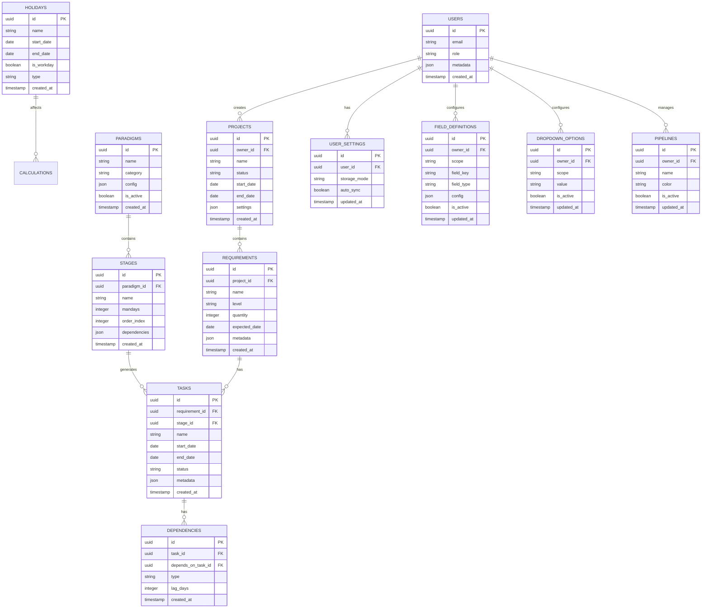

## 1. 架构设计

```mermaid
graph TD
    A[User Browser] --> B[React Frontend]
    B --> L[Local Persistence (IndexedDB)]
    B --> S[Sync Engine]
    S --> C[Supabase Client SDK]
    C --> D[Supabase Auth]
    C --> E[Supabase Database]
    C --> F[Supabase Storage]

    subgraph "Frontend Layer"
        B --> G[React Router]
        B --> H[Redux Toolkit]
        B --> I[React DnD]
        B --> J[React Grid Layout]
        B --> K[Auth Guard & Mode Switch]
    end

    subgraph "Backend Service (Supabase)"
        D
        E
        F
    end

    subgraph "External Services"
        K[ExcelJS] --> B
        L[Date-fns] --> B
        M[Mermaid] --> B
    end
```

## 2. 技术描述

- **Frontend**: React\@18 + TypeScript\@5 + Vite\@5

- **UI Framework**: TailwindCSS\@3 + HeadlessUI + Radix UI

- **State Management**: Redux Toolkit + RTK Query

- **Drag & Drop**: React DnD + React Grid Layout

- **Date Handling**: Date-fns + Dayjs

- **Chart & Gantt**: React-Gantt-Timeline + Custom Components

- **Excel Processing**: ExcelJS + SheetJS

- **Database**: Supabase (PostgreSQL\@15)

- **Authentication**: Supabase Auth（可选；未登录=本地模式）

- **File Storage**: Supabase Storage

- **Local Persistence**: IndexedDB（建议Dexie封装）

- **Sync**: Local-first同步引擎（队列 + 重试 + 冲突检测/解决）

- **Initialization Tool**: vite-init

### 2.1 登录与存储模式

- 本地模式（Guest，无需登录）：所有写入落本地IndexedDB；不访问云端

- 云端模式（Logged-in）：云端为主存储；本地仅缓存加速加载

- 本地+云端同步：本地写入→入同步队列→后台同步至云端；支持离线编辑

### 2.2 冲突策略（必须明确）

- 记录级版本：每条业务记录包含`version`（递增）与`updated_at`

- 默认合并：字段级无冲突字段自动合并

- 冲突字段：进入“冲突解决”UI，由用户选择保留本地或云端

- 严禁静默覆盖：任何可能造成跨端数据丢失的覆盖必须显式确认

## 3. 路由定义

| Route         | Purpose      | Component        |
| ------------- | ------------ | ---------------- |
| /             | 时间轴首页   | TimelineView     |
| /paradigm     | 开发范式管理 | ParadigmManager  |
| /requirements | 需求管理     | RequirementsView |
| /settings     | 系统设置     | SettingsView     |
| /login        | 用户登录     | LoginPage        |
| /profile      | 用户资料     | ProfilePage      |

## 4. 数据模型

### 4.1 核心数据表结构



说明：`FIELD_DEFINITIONS`与`DROPDOWN_OPTIONS`用于满足“设置页可增减字段/下拉项，且即时反映到表单与时间轴”的需求。

### 4.2 数据定义语言

```sql
-- 通用字段约定（用于软删除与同步）
-- 1) 业务表建议包含：owner_id / pipeline_id（如适用）
-- 2) 同步字段：version（bigint递增）、updated_at（服务端时间）、deleted_at（软删除）

-- 用户表
CREATE TABLE users (
    id UUID PRIMARY KEY DEFAULT gen_random_uuid(),
    email VARCHAR(255) UNIQUE NOT NULL,
    password_hash VARCHAR(255),
    name VARCHAR(100) NOT NULL,
    role VARCHAR(20) DEFAULT 'user' CHECK (role IN ('admin', 'manager', 'user')),
    avatar_url TEXT,
    metadata JSONB DEFAULT '{}',
    created_at TIMESTAMP WITH TIME ZONE DEFAULT NOW(),
    updated_at TIMESTAMP WITH TIME ZONE DEFAULT NOW()
);

-- 项目表
CREATE TABLE projects (
    id UUID PRIMARY KEY DEFAULT gen_random_uuid(),
    owner_id UUID REFERENCES users(id) ON DELETE CASCADE,
    name VARCHAR(200) NOT NULL,
    code VARCHAR(50) UNIQUE,
    description TEXT,
    status VARCHAR(20) DEFAULT 'planning' CHECK (status IN ('planning', 'active', 'completed', 'cancelled')),
    start_date DATE,
    end_date DATE,
    color VARCHAR(7) DEFAULT '#3B82F6',
    settings JSONB DEFAULT '{}',
    created_at TIMESTAMP WITH TIME ZONE DEFAULT NOW(),
    updated_at TIMESTAMP WITH TIME ZONE DEFAULT NOW()
);

-- 需求表
CREATE TABLE requirements (
    id UUID PRIMARY KEY DEFAULT gen_random_uuid(),
    project_id UUID REFERENCES projects(id) ON DELETE CASCADE,
    name VARCHAR(300) NOT NULL,
    level VARCHAR(10) DEFAULT 'P2' CHECK (level IN ('P0', 'P1', 'P2', 'P3')),
    quantity INTEGER DEFAULT 1 CHECK (quantity > 0),
    expected_date DATE,
    description TEXT,
    tags TEXT[],
    metadata JSONB DEFAULT '{}',
    created_at TIMESTAMP WITH TIME ZONE DEFAULT NOW(),
    updated_at TIMESTAMP WITH TIME ZONE DEFAULT NOW()
);

-- 开发范式表
CREATE TABLE paradigms (
    id UUID PRIMARY KEY DEFAULT gen_random_uuid(),
    name VARCHAR(200) NOT NULL,
    category VARCHAR(100) NOT NULL,
    description TEXT,
    config JSONB DEFAULT '{}',
    is_active BOOLEAN DEFAULT true,
    created_by UUID REFERENCES users(id),
    created_at TIMESTAMP WITH TIME ZONE DEFAULT NOW(),
    updated_at TIMESTAMP WITH TIME ZONE DEFAULT NOW()
);

-- 阶段表
CREATE TABLE stages (
    id UUID PRIMARY KEY DEFAULT gen_random_uuid(),
    paradigm_id UUID REFERENCES paradigms(id) ON DELETE CASCADE,
    name VARCHAR(200) NOT NULL,
    mandays INTEGER NOT NULL CHECK (mandays > 0),
    order_index INTEGER NOT NULL,
    dependencies UUID[] DEFAULT '{}',
    config JSONB DEFAULT '{}',
    created_at TIMESTAMP WITH TIME ZONE DEFAULT NOW()
);

-- 任务表
CREATE TABLE tasks (
    id UUID PRIMARY KEY DEFAULT gen_random_uuid(),
    requirement_id UUID REFERENCES requirements(id) ON DELETE CASCADE,
    stage_id UUID REFERENCES stages(id) ON DELETE CASCADE,
    name VARCHAR(300) NOT NULL,
    start_date DATE,
    end_date DATE,
    status VARCHAR(20) DEFAULT 'pending' CHECK (status IN ('pending', 'in_progress', 'completed', 'blocked')),
    progress DECIMAL(5,2) DEFAULT 0 CHECK (progress >= 0 AND progress <= 100),
    assignee_id UUID REFERENCES users(id),
    metadata JSONB DEFAULT '{}',
    created_at TIMESTAMP WITH TIME ZONE DEFAULT NOW(),
    updated_at TIMESTAMP WITH TIME ZONE DEFAULT NOW()
);

-- 依赖关系表
CREATE TABLE dependencies (
    id UUID PRIMARY KEY DEFAULT gen_random_uuid(),
    task_id UUID REFERENCES tasks(id) ON DELETE CASCADE,
    depends_on_task_id UUID REFERENCES tasks(id) ON DELETE CASCADE,
    type VARCHAR(20) DEFAULT 'finish_to_start' CHECK (type IN ('finish_to_start', 'start_to_start', 'finish_to_finish', 'start_to_finish')),
    lag_days INTEGER DEFAULT 0,
    created_at TIMESTAMP WITH TIME ZONE DEFAULT NOW()
);

-- 节假日表
CREATE TABLE holidays (
    id UUID PRIMARY KEY DEFAULT gen_random_uuid(),
    name VARCHAR(200) NOT NULL,
    start_date DATE NOT NULL,
    end_date DATE NOT NULL,
    is_workday BOOLEAN DEFAULT false,
    type VARCHAR(20) DEFAULT 'holiday' CHECK (type IN ('holiday', 'compensatory', 'custom')),
    description TEXT,
    created_at TIMESTAMP WITH TIME ZONE DEFAULT NOW()
);

-- 创建索引
CREATE INDEX idx_projects_owner ON projects(owner_id);
CREATE INDEX idx_requirements_project ON requirements(project_id);
CREATE INDEX idx_requirements_level ON requirements(level);
CREATE INDEX idx_tasks_requirement ON tasks(requirement_id);
CREATE INDEX idx_tasks_stage ON tasks(stage_id);
CREATE INDEX idx_tasks_dates ON tasks(start_date, end_date);
CREATE INDEX idx_dependencies_task ON dependencies(task_id);
CREATE INDEX idx_dependencies_depends ON dependencies(depends_on_task_id);
CREATE INDEX idx_holidays_dates ON holidays(start_date, end_date);

-- 权限设置
GRANT SELECT ON users TO anon;
GRANT ALL PRIVILEGES ON users TO authenticated;
GRANT SELECT ON projects TO anon;
GRANT ALL PRIVILEGES ON projects TO authenticated;
GRANT SELECT ON requirements TO anon;
GRANT ALL PRIVILEGES ON requirements TO authenticated;
GRANT SELECT ON paradigms TO anon;
GRANT ALL PRIVILEGES ON paradigms TO authenticated;
GRANT SELECT ON stages TO anon;
GRANT ALL PRIVILEGES ON stages TO authenticated;
GRANT SELECT ON tasks TO anon;
GRANT ALL PRIVILEGES ON tasks TO authenticated;
GRANT SELECT ON dependencies TO anon;
GRANT ALL PRIVILEGES ON dependencies TO authenticated;
GRANT SELECT ON holidays TO anon;
GRANT ALL PRIVILEGES ON holidays TO authenticated;
```

## 5. 核心API定义

说明：本地模式不依赖API；以下API用于云端模式/同步。

### 5.1 项目相关API

```typescript
// 创建项目
POST /api/projects
Request: {
  name: string;
  code?: string;
  description?: string;
  start_date?: string;
  end_date?: string;
  color?: string;
}

// 获取项目列表
GET /api/projects?status=active&owner_id=xxx
Response: {
  data: Project[];
  total: number;
  page: number;
  page_size: number;
}
```

### 5.2 需求相关API

```typescript
// 批量导入需求
POST /api/requirements/bulk
Request: {
  project_id: string;
  requirements: {
    name: string;
    level: 'P0' | 'P1' | 'P2' | 'P3';
    quantity: number;
    expected_date: string;
    description?: string;
  }[];
}

// 更新需求时间
PUT /api/requirements/:id/timeline
Request: {
  expected_date: string;
  reason?: string;
}
```

### 5.3 甘特图相关API

```typescript
// 生成甘特图数据
GET /api/gantt?project_id=xxx&view=week&start_date=xxx&end_date=xxx
Response: {
  projects: GanttProject[];
  holidays: Holiday[];
  dependencies: Dependency[];
}

// 更新任务时间
PUT /api/tasks/:id/schedule
Request: {
  start_date: string;
  end_date: string;
  auto_adjust_dependent: boolean;
}
```

### 5.4 节假日API

```typescript
// 获取节假日列表
GET /api/holidays?year=2024
Response: {
  data: Holiday[];
  workdays: string[]; // 调休工作日
}

// 批量设置节假日
POST /api/holidays/bulk
Request: {
  holidays: {
    name: string;
    start_date: string;
    end_date: string;
    is_workday: boolean;
    type: string;
  }[];
}
```

### 5.5 同步API（云端）

```typescript
// 拉取增量变更
GET /api/sync/pull?since=timestamp
Response: {
  changes: Array<{ table: string; id: string; version: number; updated_at: string; payload: any }>;
  server_time: string;
}

// 上送本地变更（批量）
POST /api/sync/push
Request: {
  client_id: string;
  changes: Array<{ table: string; id: string; base_version: number; payload: any }>;
}
Response: {
  applied: string[];
  conflicts: Array<{ table: string; id: string; server: any; client: any }>;
}
```

## 6. 前端架构设计

### 6.1 状态管理结构

```typescript
// Redux Store 结构
interface RootState {
  auth: AuthState
  projects: ProjectsState
  requirements: RequirementsState
  tasks: TasksState
  paradigms: ParadigmsState
  holidays: HolidaysState
  sync: SyncState
  ui: UIState
  gantt: GanttState
}

interface SyncState {
  storageMode: 'local' | 'cloud' | 'hybrid'
  online: boolean
  status: 'idle' | 'syncing' | 'pending' | 'error' | 'conflict'
  lastSyncAt: string | null
  pendingCount: number
}

// Gantt State
interface GanttState {
  view: 'day' | 'week' | 'month' | 'year'
  dateRange: {
    start: Date
    end: Date
  }
  projects: GanttProject[]
  selectedProject: string | null
  dependencies: Dependency[]
  draggingTask: string | null
  zoom: number
}
```

### 6.2 组件层级

```
App
├── AuthProvider
├── Router
│   ├── TimelineView
│   │   ├── GanttChart
│   │   │   ├── GanttHeader
│   │   │   ├── GanttBody
│   │   │   └── GanttTask
│   │   ├── ViewSwitcher
│   │   ├── FilterPanel
│   │   └── ExportButton
│   ├── ParadigmManager
│   ├── RequirementsView
│   └── SettingsView
└── NotificationProvider
```

### 6.3 性能优化策略

1. **虚拟滚动**：大量任务时只渲染可视区域
2. **防抖节流**：拖拽操作使用防抖优化
3. **数据分页**：项目和需求列表分页加载
4. **缓存策略**：节假日、范式数据本地缓存
5. **懒加载**：路由和组件按需加载

### 6.4 错误处理机制

```typescript
// 统一错误处理
class ErrorBoundary extends Component {
  componentDidCatch(error: Error, errorInfo: ErrorInfo) {
    // 记录错误日志
    logger.error('React Error:', error, errorInfo)
    // 显示友好错误页面
    this.setState({ hasError: true })
  }
}

// API 错误处理
const handleApiError = (error: AxiosError) => {
  switch (error.response?.status) {
    case 401:
      // 未授权，跳转登录
      break
    case 403:
      // 无权限，显示提示
      break
    case 422:
      // 数据验证错误，显示具体字段错误
      break
    default:
      // 通用错误处理
      break
  }
}
```

## 7. 工程规范与交付流程（强制）

### 7.1 文档一致性

- 任何实现层面的变更（交互/字段/接口/数据结构/权限/同步策略），必须同步更新：
  - [PRD.md](file:///e:/AutoGantt/.trae/documents/PRD.md)
  - [Technical_Architecture.md](file:///e:/AutoGantt/.trae/documents/Technical_Architecture.md)
  - [UI_Design.md](file:///e:/AutoGantt/.trae/documents/UI_Design.md)

### 7.2 注释规范

- JavaScript/TypeScript：
  - 文件头、函数/方法：必须使用JSDoc说明入参、返回值、用途
  - 条件判断、循环：必须添加JSDoc块或等价说明，解释分支/循环目的与边界条件
- 配置与schema：尽可能逐行注释，说明作用、可选项与默认值

### 7.3 数据库DDL注释规范

- 关系型数据库建表与字段必须使用`COMMENT`写入中文含义（表名、字段名、枚举含义）
- 示例（仅示意）：
  - `COMMENT ON TABLE projects IS '项目';`
  - `COMMENT ON COLUMN projects.name IS '项目名称';`

### 7.4 变更确认门禁（必须先确认）

除非需求提示词明确要求，否则以下操作在执行前必须先获得确认：

- 变更数据库结构（新增表/改字段/删表）
- 调整接口结构（路径/参数/响应）
- 清除数据表数据

### 7.5 质量门禁（提交前必须通过）

- ESLint扫描
- Prettier扫描
- TypeScript类型检查

### 7.6 版本与提交规范

- 会话结束必须升级`package.json`版本并提交
- 提交前更新`history.md`：`#版本（#日期) #一句话简要说明改动内容`
- Git提交信息遵循Conventional Commits

### 7.7 仓库卫生

- 开发/调试/测试生成的临时工具脚本、测试数据、调试log必须加入`.gitignore`
- 提交前检查变更文件列表，非源代码与非必要资源不得入库
